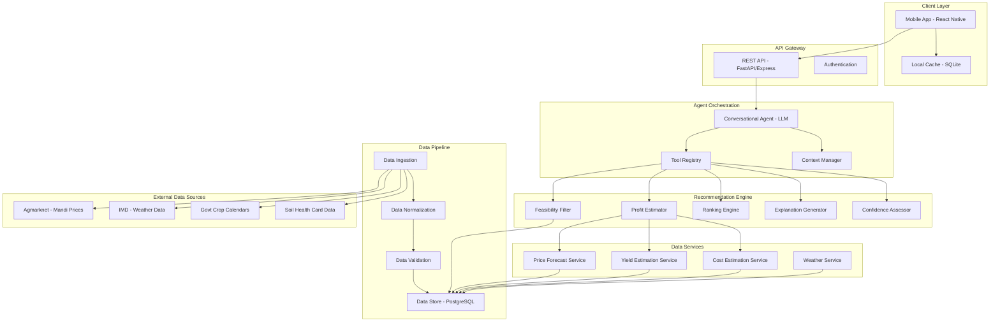
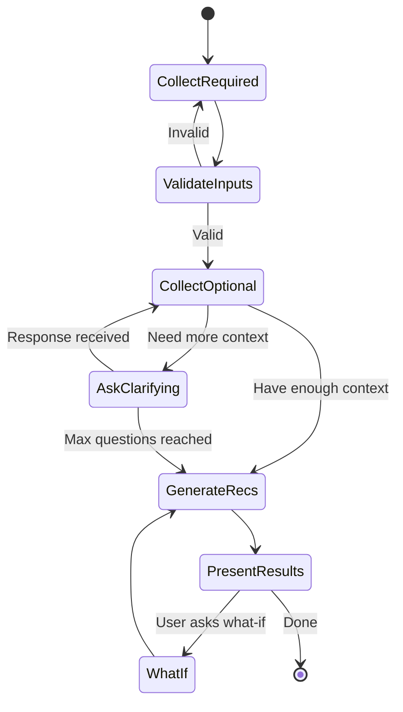

# Design Document: Farmer Profit Advisor

## Overview

The Farmer Profit Advisor is a hackathon MVP prototype that provides uncertainty-aware, explainable crop recommendations to maximize expected profit for Indian farmers. The system combines public agricultural data (crop calendars, mandi prices, weather) with simplified modeling to generate ranked recommendations with confidence assessments and natural language explanations.

The MVP targets 1-2 Indian states (e.g., Punjab, Maharashtra) and 5-10 major crops (e.g., rice, wheat, cotton, soybean, maize, chickpea, mustard). The system operates at district-level geographic resolution and supports the three major Indian agricultural seasons: Kharif (June-October), Rabi (October-March), and Zaid (March-June).

## Architecture

### High-Level Components



### Component Responsibilities

**Mobile App (Client)**
- Collects user inputs through conversational interface
- Displays recommendations with profit ranges, confidence labels, and explanations
- Caches recent recommendations for offline viewing
- Handles what-if scenario requests
- Provides mobile-optimized UI for low-literacy users

**API Gateway**
- Exposes REST endpoints for recommendation requests
- Handles authentication and rate limiting
- Routes requests to agent orchestrator
- Returns structured recommendation responses

**Agent Orchestrator**
- Manages conversational flow with user
- Asks clarifying questions (max 5 in default flow)
- Calls recommendation engine tools
- Generates natural language responses
- Grounds explanations in data

**Recommendation Engine**
- **Feasibility Filter**: Enforces season/geography constraints
- **Profit Estimator**: Computes distributional profit estimates (P10, P50, P90)
- **Ranking Engine**: Ranks crops by utility function incorporating risk preference
- **Explanation Generator**: Creates 3-5 bullet explanations per crop
- **Confidence Assessor**: Assigns low/medium/high confidence labels

**Data Services**
- **Price Forecast Service**: Forecasts mandi prices using time series models
- **Yield Estimation Service**: Estimates crop yields based on district, irrigation, weather
- **Cost Estimation Service**: Estimates input costs (seed, fertilizer, labor, irrigation)
- **Weather Service**: Provides historical and forecast weather data

**Data Pipeline**
- Ingests data from public Indian sources
- Normalizes commodity names, geographies, units
- Validates data quality
- Stores in PostgreSQL with time-series optimizations

## Data Sources and Ingestion

### Public Indian Data Sources

**Mandi Price Data**
- Source: Agmarknet (https://agmarknet.gov.in/)
- Data: Daily modal/min/max prices by commodity, mandi, date
- Frequency: Daily updates, ingest weekly
- Coverage: 3000+ mandis across India
- Normalization: Map commodity names to canonical crop list, aggregate to district level

**Crop Calendars**
- Source: State agriculture department publications, ICAR reports
- Data: Sowing windows, harvest windows by crop, district, season
- Frequency: Annual updates
- Coverage: Major crops by state/district
- Normalization: Standardize date formats, district names

**Weather Data**
- Source: India Meteorological Department (IMD) - https://mausam.imd.gov.in/
- Data: Historical rainfall, temperature by district/station
- Frequency: Daily updates
- Coverage: District-level aggregates
- Optional: Near-term forecasts (7-14 days) if API available

**Soil Health Data**
- Source: Soil Health Card portal (https://soilhealth.dac.gov.in/)
- Data: Aggregated soil nutrient levels by district/block
- Frequency: Annual updates
- Coverage: Partial (not all districts)
- **MVP Status: Out of scope - not used in hackathon prototype**

**Yield Data**
- Source: Directorate of Economics and Statistics (DES), state agriculture departments
- Data: Historical yields by crop, district, year
- Frequency: Annual updates
- Coverage: Major crops by district

**Cost Data**
- Source: Commission for Agricultural Costs and Prices (CACP) reports, state agriculture departments
- Data: Input costs (seed, fertilizer, labor) by crop, region
- Frequency: Annual updates
- Coverage: Major crops by state

### Data Normalization Strategy

**Commodity Mapping**
- Maintain canonical crop list (10-20 crops for MVP)
- Map regional names and spelling variations to canonical names
- Example: "धान" (Hindi), "Paddy", "Rice" → "Rice"

**Geographic Normalization**
- Maintain canonical state and district lists
- Handle spelling variations and administrative changes
- Use LGID (Local Government Identifier) codes where available

**Unit Normalization**
- Prices: Convert to ₹/quintal (100 kg)
- Land: Convert to acres (also support hectares)
- Rainfall: Convert to mm
- Temperature: Convert to °C
- Yield: Convert to quintals/acre

**Data Quality Validation**
- Flag missing values
- Flag outliers (>3 standard deviations from mean)
- Flag stale data (>30 days old for prices, >7 days for weather)
- Compute data quality scores for confidence assessment

## Agent Reasoning Flow

### Conversational Flow



### Question Policy

The agent follows a structured question policy to minimize user friction (max 5 questions):

**Required Questions (always ask if missing)**
1. State and district (or location permission)
2. Season (Kharif/Rabi/Zaid)
3. Sowing window (date range or "next 2 weeks")

**Optional Questions (ask if missing and relevant)**
4. Land size (for total profit calculation)
5. Irrigation availability (impacts yield and costs)
6. Risk preference (impacts ranking)
7. Storage access (impacts selling strategy)
8. Preferred selling mode (local mandi vs aggregator)

**Question Prioritization**
- If user provides location permission, skip state/district question
- If user mentions season implicitly ("planting next month"), infer season
- Ask irrigation before risk preference (higher impact on recommendations)
- Stop asking after 5 questions even if optional inputs missing

### Tool Calls

The agent has access to these tools:

**get_feasible_crops(state, district, season, sowing_window)**
- Returns list of crops that pass feasibility constraints
- Used to validate inputs and set expectations

**generate_recommendations(user_context)**
- Main recommendation generation tool
- Returns 4 crops with profit ranges, confidence, explanations
- user_context includes all collected inputs

**explain_why_excluded(crop, user_context)**
- Explains why a specific crop was not recommended
- Used when user asks about a specific crop

**run_what_if(user_context, changes)**
- Recomputes recommendations with modified inputs
- Supported changes: irrigation (none/partial/assured), sowing date (+2 weeks), storage access (yes/no)
- Generates deterministic scenario ID (hash of inputs)
- Returns comparison with original recommendations
- Caches results for identical inputs

## Modeling Approach

### Profit Computation

**Profit Formula**
```
Profit = Revenue - Costs
Revenue = Yield × Price
Costs = Seed + Fertilizer + Labor + Irrigation + Other
```

**Distributional Modeling**
- Model yield and price as probability distributions
- Use Monte Carlo simulation or analytical methods to compute profit distribution
- Extract P10, P50, P90 quantiles

### Price Forecasting

**Approach: Historical Seasonal Proxies (Hackathon MVP)**

The MVP does NOT perform true price forecasting. Instead, it uses historical seasonal patterns as proxies:

For each crop-district pair:
1. Aggregate mandi prices to district-level monthly averages
2. Compute rolling 3-year seasonal quantiles (P10, P50, P90) for the harvest month
3. Optional: Apply simple linear trend adjustment if clear trend exists (heuristic only)
4. Use these historical quantiles as price estimates for the upcoming season

**Important Limitations**
- This is NOT predictive modeling - it assumes future prices will follow historical seasonal patterns
- No ARIMA, machine learning, or sophisticated forecasting
- No guarantee that historical patterns will repeat
- Suitable for hackathon prototype, not production use

**Fallback Strategy**
- If <12 months data: Use state-level seasonal median, assign low confidence
- If 12-36 months data: Use district-level seasonal quantiles, assign medium confidence
- If >36 months data: Use district-level 3-year rolling quantiles, assign high confidence

**Price Volatility Metric**
- Compute coefficient of variation (CV) = std_dev / mean over historical data
- CV > 30%: Flag as high price risk
- CV 15-30%: Moderate price risk
- CV < 15%: Low price risk

### Yield Estimation

**Approach: Historical Average + Adjustment Factors**

Base yield = District historical average (3-5 year average)

**Adjustment Factors**
- Irrigation: none (0.7×), partial (0.85×), assured (1.0×)
- Weather: Rainfall deviation from normal (±10% per 20% deviation)
- Sowing timing: Early/late sowing penalty (±10% if outside optimal window)
- **Note: Soil health and pest risk are out of scope for MVP**

**Uncertainty Modeling**
- Use historical yield variance to model uncertainty
- P10 = base_yield × 0.7 × adjustments
- P50 = base_yield × 1.0 × adjustments
- P90 = base_yield × 1.3 × adjustments

**Fallback Strategy**
- If district data unavailable: Use state average, reduce confidence
- If state data unavailable: Use national average, assign low confidence

### Cost Estimation

**Cost Components**
- Seed: Crop-specific rate × land size
- Fertilizer: Standard NPK requirements × prices (simplified assumptions)
- Labor: Planting + weeding + harvesting (person-days × wage rate)
- Irrigation: Pumping costs if irrigation used (electricity/diesel)
- Other: Pesticides, land preparation, transport

**Data Sources**
- CACP reports for state-level cost benchmarks
- State agriculture department cost of cultivation studies
- Update annually

**Uncertainty**
- Costs are relatively stable, use ±10% range
- Irrigation costs vary with rainfall (higher pumping in dry years)

### Ranking Utility Function

**Utility Score Formula**
```
Utility = w_low × P10 + w_med × P50 + w_high × P90 - risk_penalty
```

**Risk Preference Weights**
- Low risk: w_low=0.6, w_med=0.3, w_high=0.1
- Medium risk: w_low=0.2, w_med=0.6, w_high=0.2
- High risk: w_low=0.1, w_med=0.3, w_high=0.6

**Risk Penalty**
- Penalize high price volatility (CV > 30%): -10% utility
- Penalize high weather sensitivity: -5% utility
- Penalize negative P10 (loss risk): -20% utility

**Tiebreaker**
- If utility scores within 5%: Prefer crop with lower price CV (more stable)

**Conservative Fallback**
- Select crop with highest P10 (best worst-case outcome)
- Must have CV < 20% (low volatility)
- Typically traditional crops like wheat, rice, chickpea

## Explanation Generation

### Structured Template Approach

For each recommended crop, generate 3-5 bullet explanations covering:

**1. Feasibility Explanation**
- Template: "{Crop} is suitable for {district} during {season}, with sowing typically done in {month_range}."
- Grounding: Crop calendar data

**2. Price Outlook Explanation**
- Template: "Prices have been {trend} over the past {months} months. Current mandi prices around ₹{price}/quintal. Expected harvest price: ₹{forecast_p50}/quintal."
- Grounding: Historical mandi prices, forecast
- Trend: "rising", "stable", "declining"

**3. Cost Considerations**
- Template: "Estimated costs: ₹{cost_per_acre}/acre including seed (₹{seed}), fertilizer (₹{fert}), labor (₹{labor}), and irrigation (₹{irrig})."
- Grounding: Cost estimation model
- Highlight major cost drivers

**4. Key Risks**
- Template: "Main risks: {risk_list}."
- Risk list examples:
  - "Price volatility (CV {cv}%)" if CV > 20%
  - "Weather sensitive - needs {rainfall}mm rainfall" if weather-dependent
- Grounding: Price volatility metrics, crop characteristics
- **Note: Pest and disease information is out of scope for MVP**

**5. Ranking Factors**
- Template: "Ranked #{rank} due to {reason}. Would rank higher if {improvement}."
- Reason examples:
  - "high expected profit (₹{p50}/acre)"
  - "low risk (stable prices)"
  - "good fit for your {irrigation} irrigation"
- Improvement examples:
  - "prices increase by 10%"
  - "assured irrigation available"
  - "sowing done earlier in season"

### Language Simplification

- Avoid technical jargon (use "profit" not "expected utility")
- Use local units (₹/acre, quintal)
- Use simple sentence structures
- Translate to local language if requested (Hindi, Marathi, Kannada, etc.)
- Use concrete numbers, not percentages or statistics

### Grounding Validation

Before presenting explanation:
- Verify all numbers come from actual data (not hallucinated)
- Verify crop-district-season combination is in crop calendar
- Verify price trends match historical data direction
- Verify cost estimates are within reasonable ranges (±50% of benchmarks)

### Grounding and Explanation Enforcement

**LLM Allowed Actions**
- Summarize structured model outputs (profit ranges, confidence scores, ranking positions)
- Reference computed features and metadata fields (price trends, volatility metrics, yield estimates)
- Format and present data in natural language

**LLM Prohibited Actions**
- Introduce agronomic advice not derived from datasets (e.g., specific fertilizer recommendations, pest control methods)
- Suggest soil treatments, pest management practices, or farming techniques beyond what's computed
- Make causal or prescriptive claims not computed by the model (e.g., "this will definitely increase yield")
- Invent data points or statistics not present in the model output

**Enforcement Rule**
- Any explanation containing unsupported claims must be rejected and regenerated
- All factual statements must be traceable to specific data fields or computed metrics
- Explanations are templates populated with model outputs, not free-form generation

## Confidence Assessment

### Confidence Scoring Algorithm

**Base Confidence Score (0-100)**

Start with 100, apply penalties:

**Price Data Quality**
- <12 months data: -40 points → Low confidence
- 12-36 months data: -20 points → Medium confidence
- >36 months data: 0 points → High confidence
- Missing recent data (>30 days old): -15 points
- High data sparsity (>20% missing values): -10 points

**Yield Data Quality**
- State-level aggregate (not district): -15 points
- >3 years old: -10 points
- High variance (CV > 40%): -10 points

**Weather Data**
- No forecast available: -10 points
- Forecast >7 days old: -5 points

**Model Uncertainty**
- Wide profit range (P90/P10 > 3): -10 points
- Negative P10 (loss risk): -15 points

**Final Confidence Label**
- Score ≥ 70: High confidence
- Score 40-69: Medium confidence
- Score < 40: Low confidence

### Confidence Explanation

Provide short reason for confidence level:

**High Confidence Examples**
- "High confidence: 4 years of consistent mandi data, district-level yield data, recent weather forecast available."

**Medium Confidence Examples**
- "Medium confidence: 2 years of mandi data, using state-level yield averages."

**Low Confidence Examples**
- "Low confidence: Limited price data (<1 year), using state-level estimates. Recommend caution."

## Error Handling and Failure Modes

### Failure Scenarios and Mitigations

**Scenario 1: No Feasible Crops**
- Cause: User inputs too restrictive (e.g., wrong season, unsupported district)
- Mitigation: Explain which constraints failed, suggest adjustments
- Example: "No crops found for Zaid season in this district. Try Kharif (June-Oct) or Rabi (Oct-Mar)."

**Scenario 2: Insufficient Data**
- Cause: New district with sparse data
- Mitigation: Use state-level aggregates, assign low confidence, recommend conservative crops
- Example: "Limited data for this district. Showing state-level recommendations with low confidence."

**Scenario 3: All Negative Profits**
- Cause: High costs, low prices, or poor conditions
- Mitigation: Show least-negative options, explain cost drivers, suggest input changes
- Example: "All crops show potential losses due to high input costs. Consider assured irrigation to improve yields."

**Scenario 4: API Timeout**
- Cause: Slow data services or complex computation
- Mitigation: Return cached results if available, or simplified recommendations
- Example: "Using cached recommendations from yesterday. Refresh for latest data."

**Scenario 5: Invalid User Input**
- Cause: Out-of-range values, typos
- Mitigation: Validate inputs, provide helpful error messages
- Example: "Land size must be between 0.1 and 1000 acres. Please re-enter."

**Scenario 6: Data Source Unavailable**
- Cause: External API down (Agmarknet, IMD)
- Mitigation: Use cached data, degrade gracefully, inform user
- Example: "Weather data temporarily unavailable. Using historical averages."

### Graceful Degradation Strategy

**Priority Levels**
1. **Critical**: Crop calendar (feasibility), basic price data
2. **Important**: Yield data, cost data
3. **Nice-to-have**: Weather forecast, soil health data

**Degradation Steps**
- If weather forecast unavailable: Use historical averages, reduce confidence
- If district yield data unavailable: Use state averages, reduce confidence
- If recent price data unavailable: Use older data, reduce confidence, warn user
- If crop calendar unavailable: Cannot generate recommendations, show error

## MVP vs Future Extensibility

### MVP Scope (Phase 1 - Hackathon Prototype)

**Geographic Coverage**
- 1-2 states: Punjab, Maharashtra
- District-level resolution
- ~20-40 districts total

**Crop Coverage**
- 5-10 major crops:
  - Cereals: Rice, Wheat, Maize
  - Pulses: Chickpea, Pigeon pea
  - Oilseeds: Soybean, Mustard
  - Cash crops: Cotton, Sugarcane (if data available)

**Features**
- Basic recommendation (4 crops)
- Profit ranges (P10, P50, P90) using historical seasonal proxies
- Confidence labels
- 3-5 bullet explanations
- What-if analysis (irrigation change, +2 week sowing delay, storage toggle)
- Offline caching

**Data Sources**
- Agmarknet (mandi prices)
- IMD (weather)
- Government crop calendars
- State agriculture department reports (yields, costs)

**Explicitly Out of Scope for MVP**
- Soil health integration
- Pest and disease advice
- True price forecasting (using historical proxies only)
- Market linkage or buyer matching
- Financial product recommendations

### Future Extensions (Phase 2+)

**Geographic Expansion**
- Add more states (Uttar Pradesh, Rajasthan, Andhra Pradesh, etc.)
- Block-level or village-level resolution
- GPS-based micro-location

**Crop Expansion**
- Horticulture (fruits, vegetables)
- Spices
- Plantation crops
- Minor millets

**Advanced Features**
- Market linkage (connect to buyers)
- Financial product recommendations (crop loans, insurance)
- Pest and disease alerts
- Soil testing integration
- Satellite imagery for field monitoring
- Multi-crop rotation planning
- Contract farming opportunities

**Advanced Modeling**
- Machine learning price forecasts (LSTM, Prophet) - MVP uses historical seasonal proxies
- Satellite-based yield prediction
- Climate change scenario analysis
- Water availability modeling
- Personalized recommendations based on farmer history

**Multi-Language Support**
- Hindi, Marathi, Kannada, Telugu, Tamil, Punjabi, Gujarati, Bengali
- Voice input/output for low-literacy users

**Integration**
- Government schemes (PM-KISAN, crop insurance)
- Input suppliers (seed, fertilizer)
- Extension services (KVK, agriculture officers)

### Extensibility Design Principles

**Modular Architecture**
- Each component (feasibility, profit, ranking, explanation) is independent
- Easy to swap models (e.g., upgrade price forecast from ARIMA to LSTM)
- Easy to add new data sources

**Data Schema Flexibility**
- Use JSON for flexible data storage
- Support multiple data source versions
- Graceful handling of missing fields

**API Versioning**
- Version API endpoints (/v1/, /v2/)
- Maintain backward compatibility
- Deprecation warnings for old versions

**Configuration-Driven**
- Crop list, state list, model parameters in config files
- Easy to add new crops/states without code changes
- Feature flags for gradual rollout


## Correctness Properties

A property is a characteristic or behavior that should hold true across all valid executions of a system—essentially, a formal statement about what the system should do. Properties serve as the bridge between human-readable specifications and machine-verifiable correctness guarantees.

For the hackathon MVP, we focus on 7 core properties that validate the most critical system behaviors. Additional properties are documented in the appendix for future implementation.

### Core Properties (MVP Implementation)

**Property 1: Feasibility Invariant**
*For any* generated recommendation, all recommended crops must be compatible with the user's district, season, and sowing window according to crop calendar data, and must have available feasibility data.
**Validates: Requirements FR-FEA-01, FR-FEA-02, FR-FEA-03**

**Property 2: Recommendation Structure**
*For any* recommendation request with at least one feasible crop, the system must return exactly 4 crops with complete information: profit ranges (P10 ≤ P50 ≤ P90), confidence label {low, medium, high}, and 3-5 bullet explanations.
**Validates: Requirements FR-REC-01, FR-PRF-04, FR-UNC-01, FR-CNF-01, FR-EXP-01**

**Property 3: Profit Calculation Correctness**
*For any* crop recommendation, the profit must equal revenue minus costs, where revenue equals yield times price, and costs include all components (seed, fertilizer, labor, irrigation, other).
**Validates: Requirements FR-PRF-01, FR-PRF-02, FR-PRF-03**

**Property 4: Input Validation**
*For any* user input, the system must validate that: (a) state-district pairs are in the supported region list, (b) season is one of {Kharif, Rabi, Zaid}, (c) irrigation is one of {none, partial, assured}, and (d) land size has explicit units and is in range [0.1, 1000].
**Validates: Requirements FR-INP-02, FR-INP-03, FR-INP-08, FR-INP-09, FR-SAF-04**

**Property 5: Confidence Rules**
*For any* crop recommendation, when mandi price data covers <12 months, confidence must be low; when data covers 12-36 months, confidence must be medium; when data covers >36 months with recent data, confidence must be high; and when yield data is state-level or weather forecast is unavailable, confidence must be reduced by one level.
**Validates: Requirements FR-CNF-02, FR-CNF-03, FR-CNF-04, FR-CNF-05, FR-CNF-06**

**Property 6: Explanation Grounding**
*For any* crop recommendation explanation, all factual claims must reference specific data sources (mandi names, dates, prices) and must not contain hallucinated numbers or unsupported agronomic advice.
**Validates: Requirements FR-EXP-08, FR-SAF-08**

**Property 7: Advisory Disclaimer and Safety**
*For any* recommendation response, it must include a disclaimer stating recommendations are advisory only, must never use words like "guaranteed" or "assured" in relation to profit, and all crops must be from the MVP-supported crop list and states.
**Validates: Requirements FR-UNC-04, FR-SAF-01, FR-SAF-06, FR-SAF-07**

### Additional Properties (Appendix - Future Implementation)

The following 13 properties are important for production quality but are deferred for post-hackathon implementation:

**Property A1: Risk-Based Ranking** - P10/P50/P90 weighting based on risk preference. (FR-REC-03-05, FR-PRF-10)

**Property A2: Irrigation Impact** - Yield and cost increase with irrigation. (FR-PRF-08-09)

**Property A3: What-If Determinism** - Identical inputs produce identical outputs with scenario ID. (FR-WIF-07-08)

**Property A3: What-If Determinism** - Identical inputs produce identical outputs with scenario ID. (FR-WIF-07-08)

**Property A4: Conservative Fallback** - 4th crop must have CV < 20% and highest P10. (FR-REC-06)

**Property A5: Land Size Scaling** - Total profit = per-acre profit × land size. (FR-PRF-05)

**Property A6: Required Input Enforcement** - Prompt for missing required inputs. (FR-INP-01, FR-INP-04)

**Property A7: Sowing Window Validation** - Validate window within season boundaries. (FR-INP-06)

**Property A8: Question Limit** - Max 5 clarifying questions. (FR-INP-07)

**Property A9: Price Stability Tiebreaker** - Lower CV wins ties. (FR-REC-07)

**Property A10: Confidence Explanation** - Include textual reason for confidence. (FR-CNF-07)

**Property A11: High Volatility Flagging** - Flag CV > 30% as high risk. (FR-UNC-02)

**Property A12: Weather Risk Communication** - Mention weather risk for sensitive crops. (FR-UNC-03)

**Property A13: Low Confidence Warning** - Prominent caution for low confidence. (FR-UNC-05)

**Property A14: Explanation Completeness** - Cover feasibility, price, costs, risks, ranking. (FR-EXP-02-06)

**Property A15: What-If Parameters** - Accept irrigation, sowing, storage changes. (FR-WIF-01)

**Property A16: What-If Recomputation** - Results differ when inputs affect outputs. (FR-WIF-02-04)

**Property A17: What-If Highlighting** - Show what changed and why. (FR-WIF-06)

**Property A18: Data Degradation** - Use state fallback, reduce confidence. (FR-PRF-06-07, FR-SAF-02)

**Property A19: Negative Profit Warning** - Warn and explain for P50 < 0. (FR-SAF-05)

**Property A20: Zero Feasibility** - Explain constraints, suggest adjustments. (FR-FEA-05, FR-SAF-03)

## Testing Strategy

### Hackathon MVP Testing Approach

The hackathon MVP focuses on validating critical system behaviors through handcrafted test cases and manual verification. The testing strategy is designed for extensibility to full property-based testing post-hackathon.

**What is IMPLEMENTED in the hackathon:**
- Handcrafted test cases for core invariants
- Manual verification against sample districts and crops
- Static/preloaded datasets for reproducibility
- Validation of critical properties (7 core properties)

**What is DESIGNED but NOT IMPLEMENTED:**
- Full property-based testing with randomized inputs
- Automated CI/CD pipelines
- Large-scale test coverage across all edge cases
- Comprehensive integration testing

### Core Validation Focus (Hackathon MVP)

**Critical Invariants Tested:**
1. Feasibility enforcement (no invalid crop-district-season combinations)
2. Profit calculation correctness (profit = revenue - costs)
3. Profit quantile ordering (P10 ≤ P50 ≤ P90)
4. Risk preference impact on ranking (low risk → P10 weighted, high risk → P90 weighted)
5. Confidence caps under missing data (<12 months → low confidence)
6. No-guarantee language (no "guaranteed" or "assured" in profit claims)
7. Graceful degradation under sparse data (state fallback when district data missing)

**Test Data:**
- Sample districts: 3-5 districts from Punjab and Maharashtra
- Sample crops: 5-8 crops (rice, wheat, cotton, soybean, chickpea, maize, mustard)
- Preloaded mandi price data (2-3 years historical)
- Static crop calendars and yield data

**Validation Method:**
- Manual test execution with documented inputs and expected outputs
- Scripted validation for profit calculations and quantile ordering
- Visual inspection of explanations for grounding and disclaimer compliance

### Future Validation (Post-Hackathon)

**Property-Based Testing Framework:**
- Python: Hypothesis library
- TypeScript/JavaScript: fast-check library
- Minimum 100 iterations per property test

**Full Property Coverage:**
- 7 core properties (MVP validated)
- 20 additional properties (designed, not implemented)
- Automated test generation with randomized inputs

**Test Tagging:**
Each property-based test will include a comment tag:
```python
# Feature: farmer-profit-advisor, Property 1: Feasibility Invariant
```

**Example Property Test (Future Implementation):**
```python
@given(user_context=valid_user_contexts(), crop_data=crop_calendars())
def test_feasibility_invariant(user_context, crop_data):
    """Feature: farmer-profit-advisor, Property 1: Feasibility Invariant"""
    recommendations = generate_recommendations(user_context, crop_data)
    
    for crop in recommendations:
        assert is_feasible(crop, user_context.district, user_context.season)
        assert has_feasibility_data(crop, user_context.district, user_context.season)
```

### Hackathon Test Cases

**Input Validation Tests:**
- Valid state-district pairs (Punjab-Ludhiana, Maharashtra-Pune)
- Invalid state-district pairs (Punjab-Mumbai)
- Valid seasons (Kharif, Rabi, Zaid)
- Invalid seasons ("Summer", "Monsoon")
- Valid irrigation values (none, partial, assured)
- Invalid irrigation values ("medium", "full")
- Land size with units (5 acres, 2 hectares)
- Land size without units (rejected)

**Feasibility Tests:**
- Rice in Punjab during Kharif (valid)
- Wheat in Punjab during Kharif (invalid - wrong season)
- Cotton in Maharashtra during Kharif (valid)
- Sugarcane in Punjab during Zaid (invalid - not feasible)

**Profit Calculation Tests:**
- Verify profit = (yield × price) - (seed + fertilizer + labor + irrigation + other)
- Verify P10 < P50 < P90 for all crops
- Verify total profit = per-acre profit × land size

**Ranking Tests:**
- Low risk preference: Crop with higher P10 ranks higher
- High risk preference: Crop with higher P90 ranks higher
- Medium risk preference: Crop with higher P50 ranks higher

**Confidence Tests:**
- <12 months price data → low confidence
- 12-36 months price data → medium confidence
- >36 months price data → high confidence
- State-level yield data → confidence reduced by one level

**Explanation Tests:**
- All explanations reference specific mandis and dates
- No explanations contain "guaranteed" or "assured" profit claims
- All explanations include disclaimer text

**Data Degradation Tests:**
- District price data missing → use state-level fallback
- District yield data missing → use state-level fallback
- Confidence reduced when fallback used

### Manual Verification Checklist

**Pre-Demo Validation:**
- [ ] Test 3 different districts with valid inputs
- [ ] Test 2 invalid district-season combinations
- [ ] Verify profit calculations for 5 crops manually
- [ ] Verify P10 < P50 < P90 for all recommendations
- [ ] Verify risk preference changes ranking
- [ ] Verify confidence labels match data quality
- [ ] Verify all explanations cite specific data sources
- [ ] Verify disclaimer present in all outputs
- [ ] Test what-if scenario (irrigation change)
- [ ] Test zero feasibility scenario (invalid inputs)

### Future Testing Enhancements (Post-Hackathon)

**Automated Unit Testing:**
- Full coverage of input validation edge cases
- Boundary condition testing (0.1 acre, 1000 acres)
- Error handling for API timeouts and data source failures

**Integration Testing:**
- End-to-end recommendation flow
- What-if scenario flow
- Offline caching behavior
- Data ingestion pipeline

**Performance Testing:**
- Latency: <8 seconds for initial recommendation
- Latency: <5 seconds for what-if scenarios
- Load testing: 1000 concurrent users
- Peak usage patterns (6 AM - 10 PM IST)

**CI/CD Pipeline:**
- Automated test execution on every commit
- Property-based tests with 100 iterations
- Integration tests on every PR
- Performance tests on staging before production

**Monitoring and Alerting:**
- Recommendation latency tracking
- Confidence label distribution (alert if >50% low confidence)
- Error rate monitoring (alert if >1% error rate)
- Data freshness monitoring (alert if price data >7 days old)
